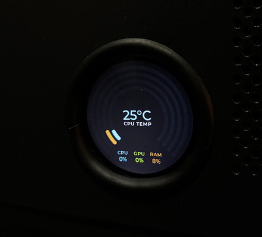
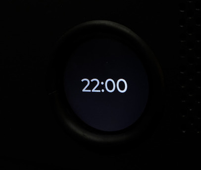

# PC System Monitor LCD

A real-time PC hardware monitor built with an ESP32, an LCD display, and a C# background worker designed for Linux.




## 📟 ESP32 Firmware

The microcontroller runs a graphical UI (powered by LVGL) to display system metrics.

**Features:**

- **Real-time Monitoring:** Displays CPU usage, GPU usage, RAM usage, and CPU temperature.
- **Smart Sleep Mode:** Automatically transitions to a Clock screen when the PC goes to sleep and serial data stops.
- **Auto-Reconnect:** Smoothly handles the PC waking up from suspend and instantly resumes displaying hardware metrics.

## 🖥️ C# PC Worker [pc-system-monitor-lcd-worker](https://github.com/joaootaviofarias/pc-system-monitor-lcd-worker)

The Linux host agent gathers system metrics and sends them over USB Serial to the ESP32. It uses `/dev/serial/by-id/` to guarantee it always connects to the correct display, and handles OS suspend/resume gracefully.

### Serial Data Format

The worker sends a single comma-separated string (`\n` terminated) on every tick.

**Format:**
`CPU_PCT, GPU_PCT, RAM_PCT, CPU_TEMP, HOUR, MINUTE, SECOND

**Example Payload:**

```text
45,60,50,55,14,30,00
```

## ⚙️ Linux Installation (systemd)

To run the C# worker automatically in the background on Fedora, you can set it up as a `systemd` service.

### 1. Permissions

Make sure your user has permission to write to serial ports:

```bash
sudo usermod -a -G dialout $USER
```

> You may need to log out and log back in for this to take effect.

### 2. Create the Service File

Create a new file for the service:

```bash
sudo nano /etc/systemd/system/pc-monitor.service
```

Paste the following configuration (update `ExecStart` and `User` to match your system):

```ini
[Unit]
Description=PC System Monitor to ESP32 LCD
After=network.target

[Service]
Type=simple
User=user

Environment="SERIAL_PORT=/dev/serial/by-id/usb-YOUR_DEVICE_ID-if00"
Environment="BAUD_RATE=115200"
Environment="INTERVAL_MS=1000"

ExecStart=/home/path/to/app

Restart=always
RestartSec=5

[Install]
WantedBy=multi-user.target
```

### 3. Enable and Start

Reload systemd and start your new service:

```bash
sudo systemctl daemon-reload
sudo systemctl enable pc-monitor.service
sudo systemctl start pc-monitor.service
```

### 4. Check Status

To view the live logs and ensure it is sending data to the ESP32:

```bash
sudo systemctl status pc-monitor.service
journalctl -u pc-monitor.service -f
```
